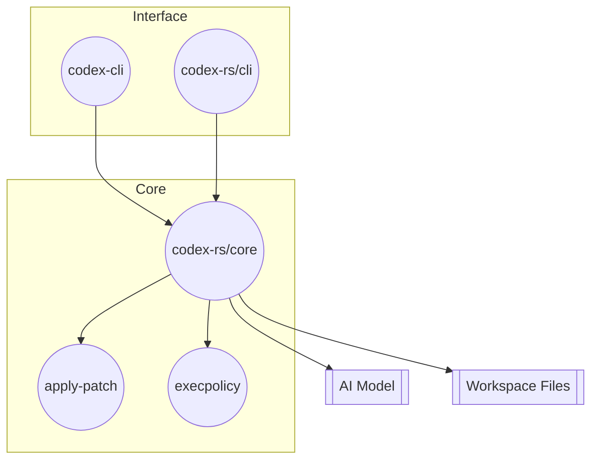

# Codex Architecture

This document provides a high level overview of the Codex project.
Rather than listing individual functions, the goal is to highlight the
main components and how they interact. The code base has two primary
entry points but most logic lives in a shared Rust workspace.

## Top level layout

- **codex-cli/** – TypeScript implementation of the CLI.  Provides the
  Node based user interface and command line glue.
- **codex-rs/** – Rust workspace that contains the core functionality
  used by both the Rust CLI and the Node CLI.
- **docs/** – Project documentation (this file lives here).

## Rust workspace crates

The `codex-rs` directory hosts multiple crates that break the system
into focused units.  The most important are:

- `core` – business logic for running Codex tasks, handling sessions,
  executing commands, and applying patches.  It implements the
  protocol used by the user interfaces.
- `cli` – native CLI front end that wires command line arguments to the
  `core` crate.
- `apply-patch` – small utility for applying patches generated by the
  agent.
- `execpolicy` – library for classifying shell commands as safe,
  forbidden or needing user approval.
- `linux-sandbox` – sandbox executable used on Linux for isolating
  commands.
- `mcp-client` and `mcp-server` – implementation of the Model Context
  Protocol for connecting Codex instances together.
- `tui` – optional text based UI built with the `tui` crate.

Other crates such as `ansi-escape` and `common` support the above
packages.

## High level flow

A simplified view of how the pieces fit together:

User commands start in either the Node or Rust CLI.  Those front ends
invoke the `core` crate which coordinates calls to the model provider,
executes or rejects commands based on `execpolicy`, and applies patches
through the `apply-patch` tool.  Results are written back to the
workspace and streamed to the user interface.

## Keeping this document relevant

The specifics of functions and modules will evolve, but the overall
structure tends to remain stable.  Summarising the intent of each crate
and how they connect makes this document resilient to code changes
while still providing a useful map of the project.
